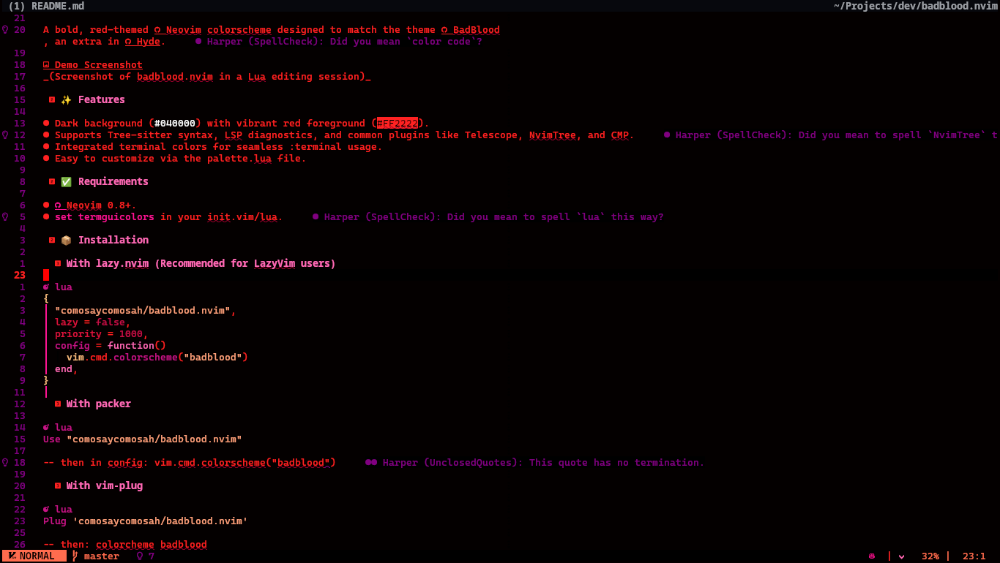

# 🩸 Bad Blood


A bold, red-themed [Neovim](https://github.com/neovim/neovim) colorscheme, designed to match the theme [BadBlood](https://github.com/HyDE-Project/hyde-gallery/blob/master/Bad%20Blood/preview.png) an extra in [Hyde](https://github.com/HyDE-Project/HyDE).



## ✨ Features

- Supports Tree-sitter syntax, LSP diagnostics, and common plugins like Telescope, Snacks, and Blink.
- Integrated terminal colors for seamless `:terminal` usage.
- Easy to customize via the `palette.lua` file.

## ✅ Requirements

- [Neovim](https://github.com/neovim/neovim) 0.9+ (recommended)
- `set termguicolors` in your `init.vim` or `init.lua`

## 📦 Installation

### With lazy.nvim (Recommended)

```lua
{
  "comosaycomosah/badblood.nvim",
  lazy = false,
  priority = 1000,
  config = function()
    vim.cmd.colorscheme("badblood")
  end,
}
```

### With packer

```lua
Use "comosaycomosah/badblood.nvim"
```

### With vim-plug

```lua
Plug 'comosaycomosah/badblood.nvim'
```

## 🧭 Usage

After installation, apply the theme:

```lua
vim.cmd.colorscheme("badblood")
```

```vim
colorscheme badblood
```

## 🎨 Customization

- Edit lua/badblood/palette.lua to change colors.
- Edit lua/badblood/groups.lua to override or add highlight groups.

## 🤝 Contributing

Contributions are welcome! Feel free to:

- Open issues (missing highlight groups, plugin support, bugs).
- Submit pull requests (new plugin support, highlight improvements).
- Fix any folly I may have made (as this is my first plugin).
